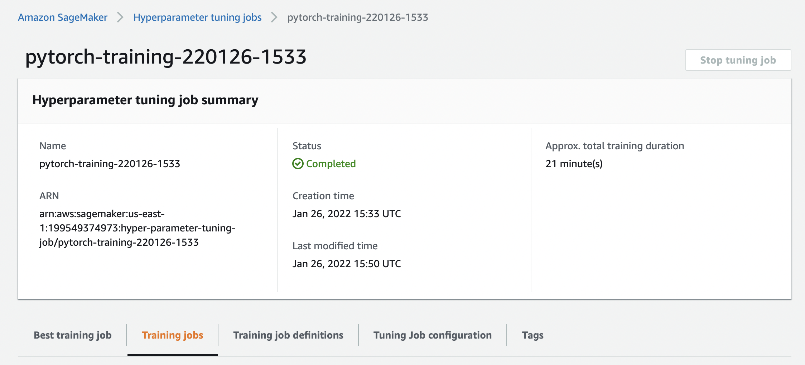
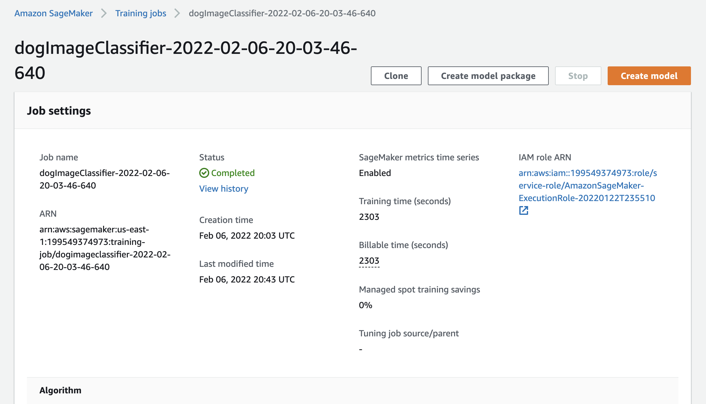
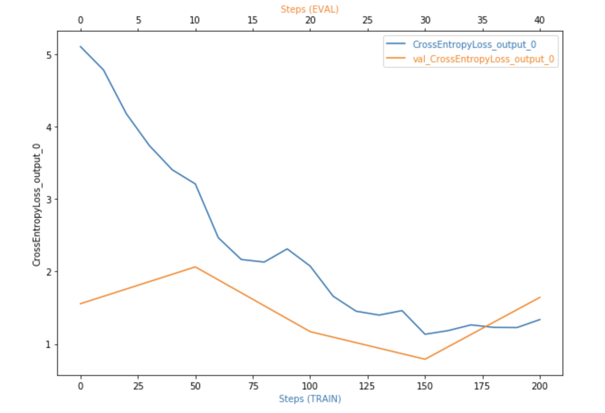
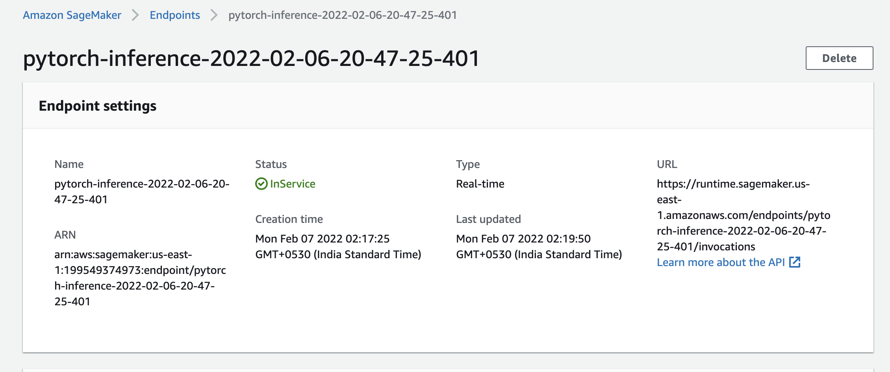

# Image Classification using AWS SageMaker

Use AWS Sagemaker to train a pretrained model that can perform image classification by using the Sagemaker profiling, debugger, hyperparameter tuning and other good ML engineering practices. This can be done on either the provided dog breed classication data set or one of your choice.

## Project Set Up and Installation
Enter AWS through the gateway in the course and open SageMaker Studio. 
Download the starter files.
Download/Make the dataset available. 

## Dataset
The provided dataset is the dogbreed classification dataset which can be found in the classroom.
The project is designed to be dataset independent so if there is a dataset that is more interesting or relevant to your work, you are welcome to use it to complete the project.

### Access
Upload the data to an S3 bucket through the AWS Gateway so that SageMaker has access to the data. 

## Hyperparameter Tuning
What kind of model did you choose for this experiment and why? Give an overview of the types of parameters and their ranges used for the hyperparameter search

- Used a pre-trained Resnet18 model and used transfer learning to train the model on our specific (dog breed classification) dataset. 
- I choose this model because it's pretrained on a very large image dataset (ImageNet) helping it identify general patterns in images and by using transfer learning we can modify the weights of the fully connected layers to that this model performs well on our specific data.
- Optimized for the learning rate, batch size and the number of epochs to use.
    - For the learning rate, I chose a linear search space from 0.001 to 0.1.
    - For the batch size, I chose a categorical search space of (16, 32, 64)
    
Completed Hyperparameter Tuning Job (Part-1) -

Completed Hyperparameter Tuning Job (Part-2) -

Completed Tranining Job for the model with best hyperparameter combination.

Remember that your README should:
- Include a screenshot of completed training jobs
- Logs metrics during the training process
- Tune at least two hyperparameters
- Retrieve the best best hyperparameters from all your training jobs

## Debugging and Profiling

Performed debugging and profiling in Sagemaker using, Sagemaker Debugger and Profiler respectively. 
To perform debugging using Sagemaker Debugger, used the following steps.
- Added hooks for the debugger and the profiler in the train() and test() functions and set them to their respective modes.
- In the main() function created the hook and registered the model to the hook. This hook is passed to the train() and test() functions.
- In the notebook, configured the debugger rules and the hook parameters.

For the profiler, used the following steps.
- Created profiler rules and config.

The debugger configuration, the profiler configuration and the rules passed to the estimator.

### Results
The results are decent for the model. Hyperparameter tunining and the final training concluded without errors. It took approximately 15 minutes to train the model. 

## Model Deployment
The model was deployed to an endpoint on Sagemaker with an instance type of "ml.m5.large". The following image shows the deployed endpoint in Sagemaker.

## Standout Suggestions
**TODO (Optional):** This is where you can provide information about any standout suggestions that you have attempted.
